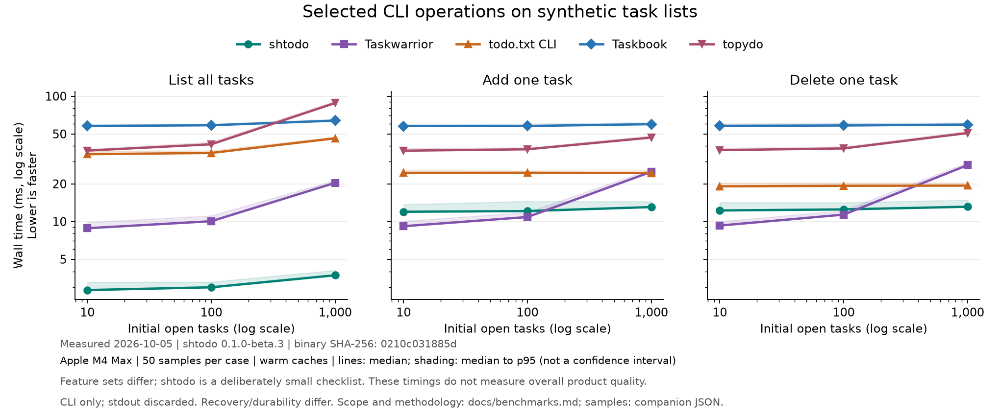

# CLI benchmarks and comparison

This suite helps track `shtodo`'s performance and understand tradeoffs among
terminal task managers. It measures a small shared workflow: process startup,
listing all tasks, adding one task, and deleting one task. All reported timings
come from running the tools locally on the same machine, with synthetic task
data. The [harness](../scripts/benchmark.py), raw samples, and rerun instructions
are included so the measurements can be inspected and repeated.

## Scope comes before speed

**`shtodo` is deliberately simpler than the other tools in this comparison.**
Today it offers a keyboard TUI for a checklist, global and per-directory lists,
manual ordering, configurable keys, browsable trash, and transient TUI
text search with All/Open/Done tabs. Its shell task commands now include add,
list, delete, done, reopen, edit, and restore, with optional `add --print-id`
output for scripts. Shell listing remains unfiltered. The current measurements
use a local beta.3 release build with the unreleased concurrency implementation.
The fuller lifecycle commands and TUI behavior are measured in a separate
[paired beta.3 comparison](./benchmarks/concurrent-usage-comparison.md).
It has no priorities, tags, scheduling, recurrence,
sync, supported import/export, or structured JSON output. See the
[current scope](./usage.md#version-one-limits) and
[feature comparison](#feature-comparison).

The other projects serve useful workflows beyond that scope:

- [Taskwarrior](https://taskwarrior.org/docs/) supports a richer task model,
  filtering and reports, automation, and configured synchronization.
- [todo.txt CLI](https://github.com/todotxt/todo.txt-cli) provides projects,
  contexts, priorities, and shell operations around an interoperable text file.
- [Taskbook](https://github.com/klaudiosinani/taskbook) organizes tasks and notes
  into boards, with priorities, search, and archive/restore.
- [topydo](https://github.com/topydo/topydo) extends the todo.txt workflow with
  scheduling, recurrence, dependencies, and additional output formats.

These measurements cover selected command latencies, not equivalent feature
sets or overall product quality. Our fixtures contain only short descriptions
and open tasks; they do not exercise scheduling, sync, or complex organization.
We have not isolated how much time comes from feature breadth, runtime startup,
report formatting, or persistence. More features alone do not establish the
cause of a timing difference. The results are a baseline for this workload on
one host, not a general recommendation to replace another task manager.

All five apps are measured together through 1,000 initial tasks. The separate
10,000-task comparisons are synthetic scaling exercises; they do not represent
everyday use for every tool. Differences in output, recovery, and durability
are documented under [method](#workloads-and-method) and
[interpretation](#interpreting-the-numbers).

## Expanded five-app comparison: October 5, 2026

This refresh measures the repaired concurrency implementation alongside all four
comparison tools at 0, 10, 100, and 1,000 tasks. It includes the missing-lock
repair for TUI writes and sync recovery. The earlier October 5 and October 4
samples remain archived below.

The measured local `shtodo 0.1.0-beta.3` release build was built from `707b0ec`
plus the worktree's concurrency changes and missing-lock repair, with Rust 1.98.0 and
the checked-in release profile. Its SHA-256 is
`0210c031885d6990e1df4a119cd14f2b0851e9e37a4b161eca1bc2e492a47281`.
Hardware is the same Apple M4 Max, 48 GB RAM, macOS 27.0.1, on AC power.
Taskwarrior 3.5.0, todo.txt CLI 2.14.0, Taskbook 0.3.0 on Node 24.15.0, and
topydo 0.16 on Python 3.14.6 retain their previous executable hashes.
All five apps were rerun together; benchmark batches ran sequentially.

This batch contains **3,050 measured invocations**: 50 samples
for each of 60 app/workload combinations and the process baseline, after five
warmup rounds. Every correctness check passed.

Median wall time at **1,000 initial tasks**, in milliseconds; lower is faster:

| App | List all | Add one | Delete one |
| --- | ---: | ---: | ---: |
| shtodo | 3.73 | 13.04 | 13.13 |
| Taskwarrior | 20.37 | 24.96 | 28.19 |
| todo.txt CLI | 46.15 | 24.34 | 19.33 |
| Taskbook | 63.86 | 59.81 | 59.35 |
| topydo | 88.26 | 46.78 | 50.83 |



These are fresh measurements of the shared CLI workload, including the
short-transaction storage path. The feature sets and recovery/durability work
still differ. Changes between separate batches do not isolate the missing-lock
repair's performance effect; the paired comparison below measures the combined
concurrency change against unchanged beta.3.

Artifacts: [all medians and p95s](./benchmarks/2026-10-05-repaired-expanded.md),
[raw samples and runtime metadata](./benchmarks/2026-10-05-repaired-expanded.json),
[SVG chart](./benchmarks/2026-10-05-repaired-expanded.svg), and
[comparison-tool provenance](./benchmarks/2026-10-04-expanded-tools.json).

### 10,000-task extension: October 5, 2026

Taskbook 0.3.0 still fails the full-list correctness preflight at 10,000 tasks.
Its renderer pads IDs to four characters using `String.repeat`; ID 10000
produces `RangeError: Invalid count value: -1`. The fresh reproduction prints
only 9,999 tasks and exits 1. The
[failure evidence](./benchmarks/2026-10-05-repaired-taskbook-10000-failure.json)
retains record counts, stderr, runtime, and source hashes. No Taskbook latency
is reported at this size.

The fresh large-list batch compares topydo with the same repaired `shtodo`
binary. It contains **450 measured invocations**, with 50
samples per case and five warmup rounds. Every correctness check passed.
Taskwarrior and todo.txt's older 10,000-task results remain in the archived
three-app baseline; different batches are not pooled into one ranking.

Median wall time at **10,000 initial tasks**, in milliseconds:

| App | List all | Add one | Delete one |
| --- | ---: | ---: | ---: |
| shtodo | 12.77 | 17.47 | 17.43 |
| topydo | 991.25 | 154.07 | 400.17 |

`shtodo`'s p95 is 13.35 ms for list,
20.03 ms for add, and
20.38 ms for delete.
These figures include each tool's normal persistence and recovery work, which
differs as described below.

Artifacts: [large-list medians and p95s](./benchmarks/2026-10-05-repaired-expanded-10000.md)
and [raw samples and metadata](./benchmarks/2026-10-05-repaired-expanded-10000.json).

## Concurrency change: October 5, 2026

The [paired beta.3 comparison](./benchmarks/concurrent-usage-comparison.md)
measures unchanged beta.3 at `707b0ec` against the repaired concurrency
implementation on this host. It retains 4,100 shell-command samples,
600 TUI actions, fresh one/two-TUI idle runs, and three concurrent-writer
load runs. Those batches are separate from the cross-tool results above.

At 10,000 records, paired plain-fixture add medians are
17.66 to 17.58 ms and list medians are
13.28 to 13.53 ms. TUI completion on the larger
Unicode/tombstone fixture goes from 12.69 to 16.13 ms (+27.1%).
Idle CPU goes from 0.0062% to 0.1246% of one core, with about
1.7 MB of logical snapshot reads per second per TUI. The report distinguishes
these costs, records p95s and exact binary hashes, and explains the successful
live-TUI writer workload.

## Earlier October 5 measurements before the missing-lock repair

The previous measurements used binary SHA-256
`f43b695f1670322e7a17bb6bc10ab1ae56059740eaff26f39230ba9ffe72f131`.
They remain intact, with their original samples and metadata:

- Five-app comparison: [tables](./benchmarks/2026-10-05-expanded.md),
  [raw samples](./benchmarks/2026-10-05-expanded.json), and
  [chart](./benchmarks/2026-10-05-expanded.svg).
- Large-list extension: [tables](./benchmarks/2026-10-05-expanded-10000.md)
  and [raw samples](./benchmarks/2026-10-05-expanded-10000.json).
- Paired concurrency measurements: [report](./benchmarks/2026-10-05-pre-repair-concurrency-comparison.md).
- [Taskbook preflight failure](./benchmarks/2026-10-05-taskbook-10000-failure.json).

## Historical runs: October 4, 2026

The earlier beta.2 measurements and charts are retained as dated evidence.
Their numbers have been superseded in the primary tables above:

- Original three-app baseline: [tables](./benchmarks/2026-10-04-macos-arm64.md),
  [raw samples](./benchmarks/2026-10-04-macos-arm64.json), and
  [chart](./benchmarks/2026-10-04-macos-arm64.svg).
- Expanded five-app comparison: [tables](./benchmarks/2026-10-04-expanded.md),
  [raw samples](./benchmarks/2026-10-04-expanded.json), and
  [chart](./benchmarks/2026-10-04-expanded.svg).
- Large-list extension: [tables](./benchmarks/2026-10-04-expanded-10000.md)
  and [raw samples](./benchmarks/2026-10-04-expanded-10000.json).
- Original [Taskbook failure and native-add reproduction](./benchmarks/2026-10-04-taskbook-10000-failure.json),
  [three-app tool manifest](./benchmarks/2026-10-04-tools.json), and
  [added-tool manifest](./benchmarks/2026-10-04-expanded-tools.json).

## Run it

Requirements: Python 3.10 or newer, a Rust toolchain compatible with this project,
and macOS or Linux. Python dependencies are not required. Build before measuring:

```sh
cargo build --release --locked
python3 -m unittest discover -s scripts -p 'test_benchmark.py' -v
python3 scripts/benchmark.py --apps shtodo
```

For a quick check:

```sh
python3 scripts/benchmark.py --apps shtodo --sizes 0 1 100 --runs 5 --warmups 1
```

To compare the original three apps, supply installed executables or unpacked releases:

```sh
python3 scripts/benchmark.py \
  --shtodo target/release/shtodo \
  --taskwarrior /path/to/task \
  --todotxt /path/to/todo.sh \
  --runs 50 --warmups 5 \
  --output target/benchmarks/comparison.json
```

Without explicit paths, the harness looks for `task` and `todo.sh` on `PATH`.
Missing executables fail the run rather than silently omitting a competitor.
Use the [Taskwarrior downloads](https://taskwarrior.org/download/) and
[todo.txt CLI releases](https://github.com/todotxt/todo.txt-cli/releases).
On macOS, Homebrew also provides `task` and
[`todo-txt`](https://formulae.brew.sh/formula/todo-txt), but package versions can
differ from the versions recorded here.

For the initial run, competitors were unpacked under `target/benchmark-tools`
without installing them globally. Their archive URLs and SHA-256 checksums are
in the [artifact manifest](./benchmarks/2026-10-04-tools.json). On macOS 27 or
newer with Apple Silicon, Python 3.12+ can fetch those exact archives:

```sh
python3 scripts/download_benchmark_tools.py
```

With those downloads present:

```sh
python3 scripts/benchmark.py \
  --taskwarrior target/benchmark-tools/task/3.5.0/bin/task \
  --todotxt target/benchmark-tools/todo.txt_cli-2.14.0/todo.sh \
  --output target/benchmarks/comparison.json
```

For Taskbook and topydo, the additional prerequisites are Node/npm and Python/uv.
The expanded run used Node 24.15.0 and Python 3.14.6. Install into the checkout
with the recorded [Taskbook dependency lock](../scripts/benchmark-deps/taskbook/package-lock.json)
and [topydo dependency pins](../scripts/benchmark-deps/topydo.txt):

```sh
mkdir -p target/benchmark-tools/taskbook
cp scripts/benchmark-deps/taskbook/package*.json target/benchmark-tools/taskbook/
npm ci --prefix target/benchmark-tools/taskbook --cache target/npm-cache --ignore-scripts --no-audit --no-fund
uv venv --cache-dir target/uv-cache --python python3 target/benchmark-tools/topydo-venv
uv pip install --cache-dir target/uv-cache --python target/benchmark-tools/topydo-venv/bin/python -r scripts/benchmark-deps/topydo.txt
```

Run the expanded five-app comparison:

```sh
python3 scripts/benchmark.py \
  --apps shtodo taskwarrior todotxt taskbook topydo \
  --taskwarrior target/benchmark-tools/task/3.5.0/bin/task \
  --todotxt target/benchmark-tools/todo.txt_cli-2.14.0/todo.sh \
  --taskbook target/benchmark-tools/taskbook/node_modules/.bin/tb \
  --topydo target/benchmark-tools/topydo-venv/bin/topydo \
  --sizes 0 10 100 1000 --runs 50 --warmups 5 \
  --output target/benchmarks/expanded.json
```

Run topydo at 10,000 tasks with a fresh `shtodo` control:

```sh
python3 scripts/benchmark.py \
  --apps shtodo topydo \
  --topydo target/benchmark-tools/topydo-venv/bin/topydo \
  --sizes 10000 --runs 50 --warmups 5 \
  --output target/benchmarks/expanded-10000.json
```

Taskbook runs via the actual Node executable, resolved once using
`node -p process.execPath`. This excludes runtime-manager shim lookup from the
timer while retaining Node startup. Use `--node /path/to/node` to select a runtime.
Without tool paths, `--apps taskbook topydo` looks for `tb` and `topydo` on `PATH`.
The default app set remains the original three for compatibility.

Use `--seed` to change the randomized execution order, `--sizes` to change the
task counts, and `--work-dir` to choose the filesystem being measured. The default
work directory is beneath `target/benchmarks` on the checkout's filesystem.
Only a newly created temporary subdirectory is reset and removed.
Taskwarrior's native 10,000-task import can take several minutes during setup;
use `--sizes 0 10 100 1000` for a shorter comparison. Import has a separate
15-minute timeout and its duration is not a reported command latency.

Every run writes JSON with individual samples, medians, nearest-rank p95,
mean, standard deviation, min/max, execution order, versions, executable hashes,
configuration, build configuration, Git state, and machine details. Expanded
runs also record runtime versions/hashes, the installed npm lock hash when
available, Python package versions, and the checked-in dependency lock hashes.
The recorded harness hash identifies the script at measurement time. Report
wording and chart captions were subsequently updated to make scope differences
explicit; raw JSON samples and recorded metadata are unchanged. A companion
Markdown table is generated from the same data. Output files are replaced when
the same `--output` path is reused. Run on an otherwise idle machine connected to
power; avoid compiling or running other benchmarks concurrently.

An optional plotting script turns the same JSON into PNG and SVG charts. Its
Matplotlib dependency is separate from the dependency-free measurement harness:

```sh
python3 -m venv target/benchmarks/plot-venv
target/benchmarks/plot-venv/bin/python -m pip install matplotlib==3.11.2
target/benchmarks/plot-venv/bin/python scripts/plot_benchmarks.py target/benchmarks/comparison.json
```

The chart shows medians and shading up to p95, not a confidence interval. Both
axes use logarithmic scales; initialized-empty and version results remain in the
tables. Generate charts after the benchmark to avoid competing with measurements.

## Workloads and method

| Workload | shtodo | Taskwarrior | todo.txt CLI |
| --- | --- | --- | --- |
| Startup proxy | `--version` | `--version` | `-V` |
| List all initial tasks | `list` | `bench limit:0` | `list` |
| Add one task | `add "Benchmark task 99999999"` | Same arguments | Same arguments |
| Delete first live task | `delete 1` | `1 delete` | `del 1` |

| Workload | Taskbook | topydo |
| --- | --- | --- |
| Startup proxy | `--version` | `-v` |
| List all initial tasks | No arguments, default board view | `ls` |
| Add one task | `--task "Benchmark task 99999999"` | `add "Benchmark task 99999999"` |
| Delete first live task | `--delete 1` | `del -f 1` |

All fixtures contain the same short, unique ASCII descriptions and only open
tasks. The 0-task case is an initialized empty store, not first installation.
Deletion is omitted for empty lists. `shtodo` uses its global scope.

Fixtures are created outside the timer using native `shtodo`/Taskbook JSON, plain
todo.txt lines for both text-file tools, or Taskwarrior's JSON import. Taskbook's
tasks are normal-priority, unstarred, incomplete tasks in its default `My Board`.
A full list read initializes ordinary caches
and verifies the fixture. The harness snapshots that state and restores it before
**every invocation**, including warmups and reads. Adds never accumulate tasks;
deletes always act on a live task. Taskwarrior's import history is part of its
baseline, which is not necessarily identical to a store built by repeated adds.

Each child receives an isolated home, XDG paths, temporary directory, and app
configuration. The environment uses an allowlist so inherited `TASKDATA`,
`TODO_FILE`, shell startup settings, and similar overrides cannot select real
task data. No hooks, plugins, sync services, or custom user configuration are
installed in these stores.

Taskwarrior uses an explicit report with ID, status, and description, sorted by
ID and filtered to pending tasks. `limit:0` disables truncation. Colors and
confirmation prompts are off; optional verbosity is suppressed. Its default
storage, garbage collection, and hook behavior are retained. An unpacked
Taskwarrior package's default theme is copied beside its isolated config so
relocating the package does not break resource lookup. todo.txt uses `-p` for
plain output and `-f` to suppress prompts, retaining its normal sorting and
verbosity. These are similar user operations, not byte-identical output formats
or a comparison of default report richness.

Taskbook uses its default board view and progress summary, with color and update
notifications disabled. topydo uses an explicit isolated config and `-C 0`, with
unlimited list output. Its normal sorting, creation-date behavior, and five-entry
backup setting remain enabled. Snapshot resets mean each mutation starts with no
prior backups or archived tasks; this does not measure long-running history.

Each round shuffles all app/workload/size cases and an external `true` process
baseline. Five warmup rounds precede 50 measured rounds by default. Measurements
use Python's monotonic `perf_counter_ns`, direct subprocess execution, and a
blocking wait through process exit. No extra shell wraps native binaries;
todo.txt still runs its own Bash script and utility processes. Taskbook includes
Node startup and module loading; topydo includes Python startup and imports. Stdin and stdout
use the null device; stderr uses a temporary file. Process launch and harness
launch overhead are included. The `true` measurement is reported separately,
not subtracted from results.

Preflight checks run the exact commands and verify that list output contains
every expected description exactly once. Each timed add/delete is followed by
an untimed read verifying the entire resulting task set. `shtodo`'s retained
tombstone, Taskbook's archived task, and topydo's backup of the pre-mutation task
set are also checked. Integration tests additionally recover Taskbook's deleted
task and revert topydo's add/delete using their actual CLI commands.
Unexpected exit codes or incorrect results abort the
run. Taskwarrior's empty-report behavior is handled by allowing exit
code 1 only for empty lists, with a separate content check.

## Interpreting the numbers

- Read timings together with the feature comparison. `shtodo`'s smaller scope
  and different implementations mean these are not measurements of identical
  functionality. A slower result for one command does not measure the value of
  scheduling, interoperability, automation, or another capability.
- These are warm-cache, single-process CLI latencies on one host. Copying a
  fixture warms filesystem caches and can influence subsequent disk writeback.
  They are not cold-boot, concurrent-writer, or terminal-rendering measurements.
- `--version` measures a minimal startup path. It does not measure opening the
  TUI, first visible frame, navigation, or editing responsiveness.
- `shtodo` retains deleted tasks and validates, serializes, and atomically
  replaces its full snapshot on a mutation, syncing both the temporary file and
  directory. Taskwarrior uses TaskChampion-backed storage and retains deleted
  task state. todo.txt CLI removes the task text, normally leaving a blank line
  to preserve line numbers. Do not equate deletion speed with equivalent undo
  or crash-durability guarantees. See [shtodo storage](../src/storage.rs),
  [Taskwarrior's manual](https://taskwarrior.org/docs/man/task.1/), and
  [todo.txt CLI source](https://github.com/todotxt/todo.txt-cli/blob/v2.14.0/todo.sh).
- Taskbook rewrites JSON through a temporary file and rename and separately
  archives deleted tasks. Its tested storage implementation has no explicit
  file/directory sync. topydo saves compressed backups by default and rewrites
  the text file; backup recovery is different from crash durability. See
  [Taskbook storage](https://github.com/klaudiosinani/taskbook/blob/master/src/storage.js)
  and [topydo changesets](https://github.com/topydo/topydo/blob/0.16/topydo/lib/ChangeSet.py).
- These cross-tool fixtures do not benchmark completed tasks, accumulated
  deletion history, long or Unicode descriptions, filtering, recurrence, sync,
  memory usage, or disk usage. The separate
  [concurrency comparison](./benchmarks/concurrent-usage-comparison.md) includes
  Unicode/tombstones and TUI/idle workloads.
  `fixture_bytes` in JSON is setup diagnostics, not a storage-efficiency ranking.
- p95 with 50 samples is a descriptive tail estimate. Small differences near
  the process baseline deserve repeated runs on other machines before making
  public comparative claims. Absolute milliseconds are more useful than a
  single aggregate speedup score.
- The local `release` build uses size optimization and full LTO. The release
  packaging `dist` profile uses thin LTO. This baseline is not a measurement of
  a downloaded `shtodo` release asset.

## Feature comparison

This is a documented-capability comparison, not a usability study. The tested
versions are `shtodo 0.1.0-beta.3` with the unreleased concurrency changes,
Taskwarrior 3.5.0, todo.txt CLI 2.14.0, Taskbook 0.3.0, and topydo 0.16.
The `shtodo` column describes the current development behavior. TUI behavior
and the fuller shell lifecycle have their own
[paired measurements](./benchmarks/concurrent-usage-comparison.md).

| Capability | shtodo | Taskwarrior | todo.txt CLI |
| --- | --- | --- | --- |
| Interaction | Built-in keyboard TUI and small CLI | Rich CLI | Bash CLI |
| Shell task lifecycle | Add, list, done, reopen, edit, delete, restore | Add, list, modify, done, delete | Add, list, replace, do, delete |
| Organization | Global and exact-directory lists; TUI text search and All/Open/Done tabs | Projects, tags, contexts, filters | Text files, `+projects`, `@contexts`, text filtering |
| Priority and scheduling | Neither | Priority, due dates, recurrence | Letter priorities; dates/text conventions, no core recurrence scheduler |
| Data and integration | Local versioned JSON; no supported import/export | TaskChampion storage; JSON import/export and hooks | Human-editable text; add-ons |
| Sync | None | Configured TaskChampion sync | External file tooling; no core sync engine |
| Delete recovery | Retained tombstones; shell restore by ID or latest/selective restoration in TUI | Deleted status and undo | No equivalent core undo command |

Sources: [shtodo usage](./usage.md),
[Taskwarrior documentation](https://taskwarrior.org/docs/),
[Taskwarrior command reference](https://taskwarrior.org/docs/man/task.1/),
[Taskwarrior sync](https://taskwarrior.org/docs/sync/),
[todo.txt CLI usage](https://github.com/todotxt/todo.txt-cli/blob/master/USAGE.md),
and the [todo.txt format](https://github.com/todotxt/todo.txt).

| Capability | Taskbook | topydo |
| --- | --- | --- |
| Interaction | Node CLI with board and timeline views | Python CLI; optional prompt and column modes |
| Shell task lifecycle | Add, check, begin/pause, edit, delete, restore | Add, list, edit, complete, delete, revert |
| Organization | Boards, notes, stars, search and attribute filters | todo.txt projects/contexts, filters, dependencies |
| Priority and scheduling | Three priority levels | Letter priorities, due/start dates, recurrence |
| Data and integration | Local JSON and configurable storage path | Human-editable todo.txt with extensions |
| Sync | External file tooling | External file tooling |
| Delete recovery | Separate archive and restore command | Revert from compressed backups; five retained by default |

Sources: [Taskbook usage](https://github.com/klaudiosinani/taskbook),
[topydo documentation](https://topydo.org/),
[topydo feature overview](https://github.com/topydo/topydo), and the installed
0.3.0/0.16 command implementations. Only topydo's core CLI dependencies were
installed; optional interactive modes were not part of this benchmark.

The practical choice depends on the workflow: `shtodo` offers a small interactive
list with project-directory separation; Taskwarrior adds a much richer task model
and automation; todo.txt emphasizes editable, portable text. Taskbook adds a
board/notes workflow, while topydo extends the text-file model with scheduling.
Timing the shared operations does not assign a value to those additional capabilities.
